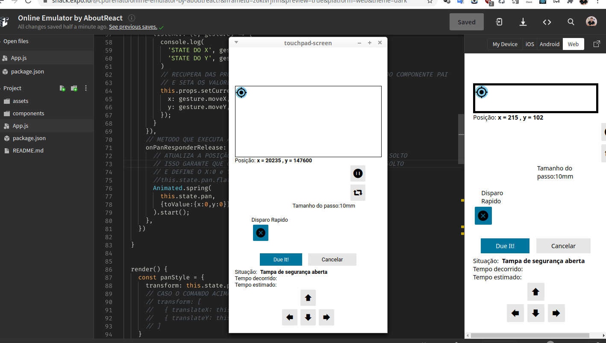

# Touchpad Screen

## React Native

```sh
npm install expo-cli — global
npm install
npm run web
expo start
```
<hr>

<p align="center"><a href="https://github.com/lucenarenato/react-native-touchpad-screen" target="_blank"></a></p>
<br>
<p align="center"><a href="https://github.com/lucenarenato/react-native-touchpad-screen" target="_blank"></a></p>

<hr>

## Renato Lucena